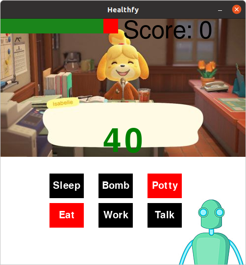

## Welcome to Healthfy

This game is all about keeping a humanoid alive. This humanoid is simply an icon with a health bar. The player needs to keep this humanoid alive by correctly commanding the feeding, working, socializing, sleeping, and bathroom usage of this humanoid.
[Home Page](https://mcardos.github.io/project-3-healthfy/)
[Learn Pygame](https://mcardos.github.io/project-3-healthfy/learnpygame)
[Game Demo](https://mcardos.github.io/project-3-healthfy/gamedemo)

### The Code

Below you will find all the code you need to copy this game into your own local machine and play around with it.

# Playing the Game:
1. Install Pygame (`python3 -m pip install -U pygame --user`)
2. [Clone](https://docs.github.com/en/free-pro-team@latest/github/creating-cloning-and-archiving-repositories/cloning-a-repository) the repo: `https://github.com/mcardos/project-3-healthfy.git`
3. `cd` into the cloned repo and run the main_game.py
4. Have fun!

```markdown
A quick glance of the code:
# Main loop:
RUNNING = True
while RUNNING:
    model.screen.fill((250, 250, 250))
    for event in pygame.event.get():
        if event.type == QUIT:
            RUNNING = False
        if event.type == TIMER:
            model.countdown()
```
# Healthfy Game



## Song Credit:
The backgroung song used is [Picket Fences Lol](https://www.youtube.com/watch?v=W1tXhcUnwSU) by Huron John. You can check out his [Instagram here](https://www.instagram.com/huronjohnny/?hl=en) and his [Youtube channel](https://www.youtube.com/channel/UCTnqiXwiMtMnTrQLjD6MZFQ) for more!

## Stay alive Humanoid!
### The MVC Architecture
  1. [Model Class](https://github.com/mcardos/project-3-healthfy/blob/main/classes.py)
  2. [View Class](https://github.com/mcardos/project-3-healthfy/blob/main/view.py)
  3. [Controller Class](https://github.com/mcardos/project-3-healthfy/blob/main/controller.py)

## What's the big idea?
The big idea behind this game is to create a fun, family game that combines the aspects of several of our favorite games. We have the Whack-a-Mole style buttons; the Sims styled goal of keeping things alive and the cute Animal Crossing visuals. 

## Who are we:
The code and this website was developed by Maria and Deng.


Maria and Deng are both students at Babson College who decided to take a coding class at Olin College despite not having any prior coding experience. But they came up with this beautiful game.

>> LinkedIn: [Maria Cardoso](https://www.linkedin.com/in/mariacardoso18/)
>> LinkedIn: [Daniel Deng Chol](https://www.linkedin.com/in/daniel-deng-chol/)

### Need a little more?
For more information visit our GitHub repo at https://github.com/mcardos/project-3-healthfy/

