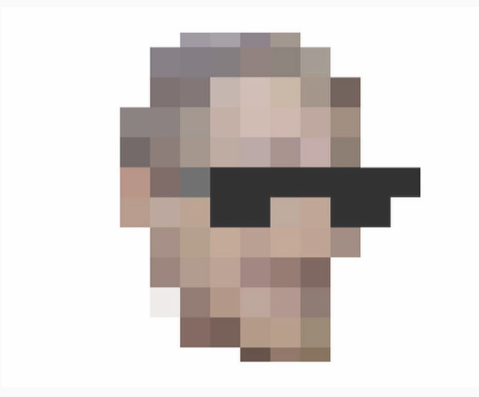

# Learn Pygame
## Make your own game today with Pygame!
You can view all the appropriate docs right at the source: [Pygame](https://www.pygame.org/docs/)

## **Or** you can follow along to the very helpful, and _short videos_ from [sentdex](https://pythonprogramming.net/pygame-buttons-part-1-button-rectangle/)

We, Maria and Deng, are very grateful to sentdex and his tutorials, especially on how to make active buttons with pygame. _(Linked above!)_

